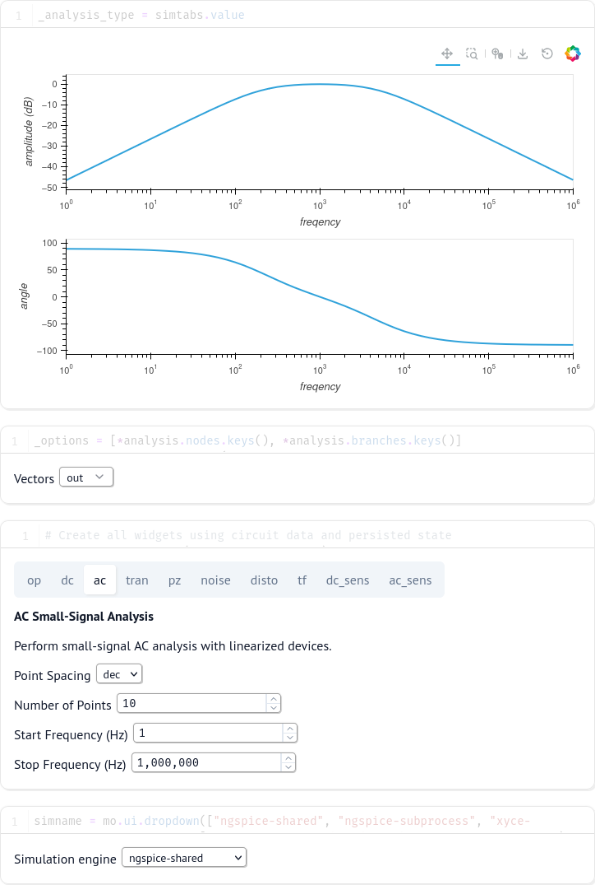

The simulator user interface is a [Marimo](https://marimo.io/) notebook that uses the [Python API](Python-API.html) to run simulations and plot their results. The notebook provides a unified, fully customizable interface that combines simulation configuration, execution, and visualization in a single reactive environment.

The intention is for the simulator notebook to remain relatively simple and accessible, while the same [Python API](Python-API.html) can be used in other Python environments to create more advanced simulations, analysis, automation, and all that good stuff that would make the interface overly complex.

# Unified Notebook Interface



The Marimo notebook provides a unified interface where all simulation configuration, execution, and visualization happen together. The interface is fully reactive - when you change simulation parameters, the notebook automatically updates to reflect those changes.

## Schematic Integration

At the top of the notebook, a schematic bridge widget connects directly to the schematic editor. When you click the simulate button from the schematic editor, the notebook automatically receives the schematic data and generates the SPICE netlist.

## Simulation Type Selection

The notebook uses a tabbed interface to select and configure different analysis types. The fields of each simulation correspond directly with the fields listed in section 15.3 of the [NgSpice manual](https://ngspice.sourceforge.io/docs/ngspice-manual.pdf). Currently supported analysis types include:

1. **Operating Point (op)** - Find the DC operating point with capacitors open and inductors shorted
2. **DC Sweep (dc)** - Compute DC operating point while sweeping independent sources
3. **AC Small-Signal Analysis (ac)** - Perform small-signal AC analysis with linearized devices
4. **Transient Analysis (tran)** - Perform non-linear time-domain simulation
5. **Pole-Zero Analysis (pz)** - Compute poles and zeros of the transfer function
6. **Noise Analysis (noise)** - Perform stochastic noise analysis at the DC operating point
7. **Distortion Analysis (disto)** - Analyze harmonic or spectral distortion in the circuit
8. **Transfer Function Analysis (tf)** - Compute DC small-signal transfer function, input and output resistance
9. **DC Sensitivity Analysis (dc_sens)** - Compute sensitivity of DC operating point to device parameters
10. **AC Sensitivity Analysis (ac_sens)** - Compute sensitivity of AC values to device parameters

Each tab provides relevant parameters for that analysis type, with descriptions and appropriate input widgets. The notebook persists your configuration across sessions, so your settings are remembered.

## Vector Selection

Below the simulation configuration, a multi-select widget allows you to choose which vectors (node voltages and branch currents) are plotted. The available vectors are automatically populated from the simulation results, showing all nodes and branches available in the circuit.

If you select nothing, the simulation still runs and saves all node voltages and some branch currents, but only selected vectors will be displayed in the plot.

## Simulation Engine

The notebook supports multiple simulation engines through a dropdown selector:

- **ngspice-shared** - NgSpice using shared library interface (default)
- **ngspice-subprocess** - NgSpice as a subprocess
- **xyce-serial** - Xyce serial simulator
- **xyce-parallel** - Xyce parallel simulator (for large circuits)

The simulator engine can be changed at any time to compare results or take advantage of specific simulator features.

The notebook runs in both **native** and **WebAssembly (WASM)** modes. In native mode, all simulation engines are available depending on what's installed on your system. In WASM mode (such as when running in the browser), only **ngspice-shared** is available, compiled to WebAssembly for in-browser execution.

## Interactive Plotting

The plot area uses [Holoviews](https://holoviews.org/) to display high-performance interactive plots. The type of plot is automatically selected based on the simulation type:

- **DC Sweep**: X-Y plot of swept parameter vs. selected vectors
- **Transient**: Time-domain waveforms
- **AC Analysis**: Bode plots (magnitude and phase vs. frequency)

The plots are fully interactive with zoom, pan, and hover capabilities. For transient and sweep analyses with large datasets, the notebook can handle millions of points efficiently.

## Back Annotation

For **Operating Point** analysis, the "Back-annotate" checkbox allows you to push simulation results back to the database, where they can be picked up from the schematic editor in [annotations]. This is useful for seeing operating point voltages and currents directly on the schematic.

The intended use is for operating point analysis and small sweeps. It is possible but strongly discouraged to use this setting on transient analysis, which will potentially store millions of points in the database.

## Probe Integration

When you use the probe tool in the schematic editor to click on a wire, its voltage is automatically added to the vector selection and plotted. This provides seamless integration between the schematic and simulation views.

## Notebook Customization

Since the interface is built with Marimo, you can fully customize the notebook by:

- Adding additional analysis cells
- Creating custom plots and visualizations  
- Adding Python code to process simulation results
- Combining multiple simulations for comparison
- Automating parameter sweeps and optimization

The notebook file is located at `src/marimo/notebook.py` and can be edited to suit your workflow. Any changes are immediately reflected when you re-run the notebook.

## Running Standalone

While the notebook integrates seamlessly with the schematic editor, it can also be run standalone using the `nyancad-server` command, which provides the necessary infrastructure for the schematic bridge widget:

```bash
nyancad-server
```

This starts the integrated server that serves both the schematic editor and the notebook interface. The schematic bridge widget requires the nyancad-server infrastructure to function properly - running the notebook with plain `marimo edit` will not have a functional schematic bridge.
