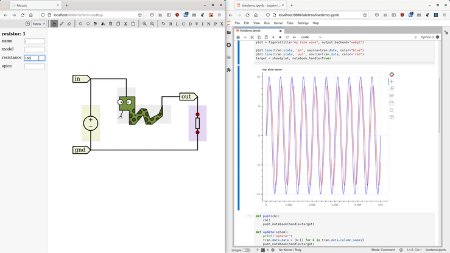

## Modern schematic entry and simulation

Mosaic is a tool for designing and simulating analog integrated circuit designs. It focuses on a modern, easy to use interface, instant design feedback, design reuse, verification, and automation.

### Web based

Manage PDKs and IP in your own server environment, while providing a snappy user interface. No more laggy remote desktop to manage your EDA tools.
Mosaic can be installed in many configurations, including an offline desktop app or an on-premise hosted instance.

### Powerful editor

Mosaic is designed with professional chip designers in mind, and doesn't let eyecandy and ease of use get in the way of streamlined editing and a full complement of keyboard shortcuts to edit at maixmum velocity.

### Offline-first real-time collaboration

Effortlessly share, review, and collaborate in real-time, wherever you are. It's as simple as sharing the link. No more emailing files or messing with file permissions. Mosaic will remain fast and available no matter your internet connection, and synchronise your changes when you reconnect.

### Versatile simulation options

Mosaic comes with a simple simulation interface that allows running basic simulations and plotting their results at the click of a button, and from there offers a seamless transition to a Jupyter notebook environment for doing more advanced analysis and automation. There is no "simulation cliff" in what can be done in the graphical interface or some obscure domain specific language, everything is powered by the same simple Python API. The open source edition of Mosaic supports NgSpice and Xyce. Contact us for support of commercial simulators and PDKs.

### High-performance streamed plotting

Mosaic uses a streaming simulation API that allows you to do analysis and plotting *while the simulation is running*.
This allows you to spot problems early, rather than guessing at the required simulation length and waiting for it to finish.
All the wile, Mosaic can plot tens of millions of points without breaking a sweat, and offer interactive panning and zooming to boot.

### Real-time back-annotation

It is crucial for a designer to have feedback about their work and quickly explore the effect of various changes.
Real-time back-annotation will run short simulations like operating point and frequency analysis in the background and annotate your schematic with currents, voltages, gains, bandwidths, etc.

### Coming soon: tablet support

There is nothing like a powerful workstation, but sometimes a tablet might be just what you need to take your design to a meeting, a colleague, the train, the couch, or the garden.

### Related tools

* [SimServer](https://github.com/NyanCAD/SimServer), an RPC API for streaming data from Ngspice, Xyce, CXXRTL & more
* [Pyttoresque](https://github.com/NyanCAD/Pyttoresque), a Python library for doing simulation and analysis

This project was funded through the <a href="/PET">NGI0 PET</a> Fund, a fund established by <a href="https://nlnet.nl">NLnet</a> with financial support from the European Commission's <a href="https://ngi.eu">Next Generation Internet</a> programme, under the aegis of DG Communications Networks, Content and Technology under grant agreement No 825310.
